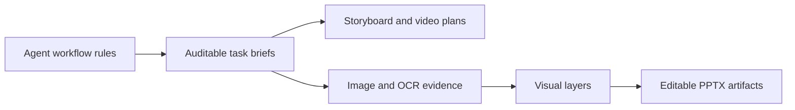

<h1 align="center">TateZhouSiu</h1>

  Building agent workflows, visual-layer pipelines, and editable presentation tooling.

  
  
  
  
  

## Current Focus

I am exploring practical ways to make AI-assisted work more structured, inspectable, and reusable:

- agent operating systems for real codebases: `AGENTS.md`, persistent project memory, and verification-first workflows
- multi-agent task briefs with clear roles, ownership, forbidden actions, output contracts, and stop conditions
- storyboard production packages for AI video workflows, with continuity bibles, shot handoffs, and edit plans
- image-to-PPT reconstruction: splitting flat slide images into visual layers, recovering text, and rebuilding editable decks
- OCR and visual QA pipelines for turning generated or screenshot-based slides into structured artifacts

## Open Source Projects

| Project | What it does | Start here |
| --- | --- | --- |
| [Image-PPT-King](https://github.com/TateZhouSiu/image-ppt-king) | End-to-end workflow for rebuilding image-based slides into editable PowerPoint decks. | `README.md` and `docs/architecture.md` |
| [Image Split](https://github.com/TateZhouSiu/image-split) | Splits slide/page images into editable-ready transparent visual layers with OCR evidence tooling. | `docs/ocr-tools.md` |
| [Create Storyboard Skill](https://github.com/TateZhouSiu/create-storyboard-skill) | Codex skill for continuity-first storyboard production packages for Image 2 and SceneDance/Seedance. | `skills/create-storyboard/SKILL.md` |
| [Agents MD Kit](https://github.com/TateZhouSiu/agents-md-kit) | A starter kit for project-level agent rules and persistent `agent_memory`. | `AGENTS.md` |
| [Multi-Agent Skill](https://github.com/TateZhouSiu/multi-agent-skill) | A reusable Codex skill for scoped delegation, review, and handoff briefs. | `skills/multi-agent/SKILL.md` |

## Technical Direction

The common thread across these projects is artifact-centered automation: keep the agent's work observable, keep intermediate files useful, and make the final output editable by humans.

## Stack

`Python` · `Node.js` · `Markdown` · `OCR` · `PowerPoint/PPTX` · `AI video planning` · `computer vision` · `Codex Agent Skills`

## 中文

我主要在整理 Agent 工作流、AI 视频分镜制作包、图像拆层、OCR 证据链和 PPT 可编辑化这几条技术路径，希望把 AI 生成内容从“一次性输出”推进到“结构清晰、可验证、可继续编辑的工程资产”。
